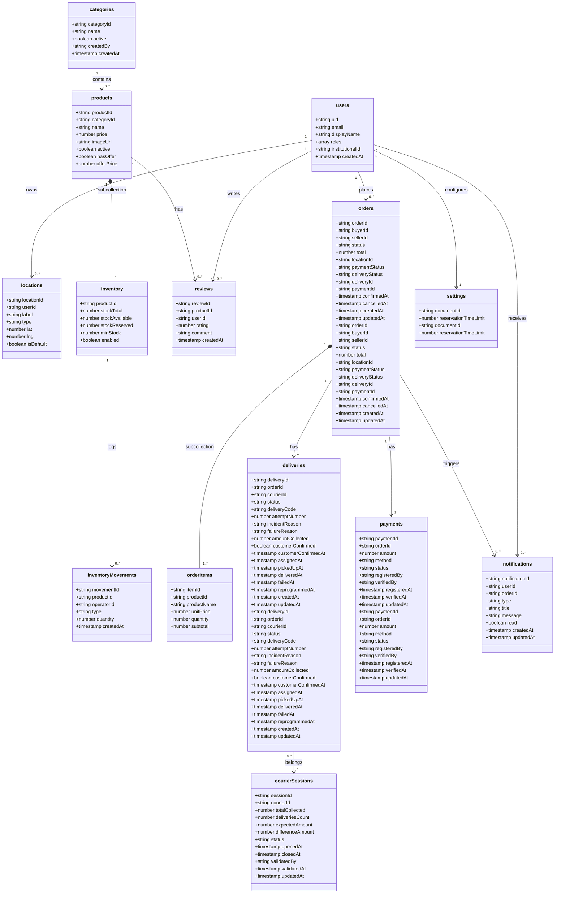

# Sansistore

Internal team docs and contribution workflow for the Sansistore project.

## Docs

Project documentation (start here): https://procesosagilesumss.github.io/sansistore/

## Environments (Vercel)

| Branch       | Purpose                    | Deploy URL                         |
| ------------ | -------------------------- | ---------------------------------- |
| `main`       | Staging / QA (pre-release) | https://sansistore-test.vercel.app |
| `production` | Production (live)          | https://sansistore-umss.vercel.app |

## New dev quick start

```bash
bun install
bun dev
```

Scripts:

```bash
bun dev
bun build
bun preview
bun astro check
```

If you need environment variables (Firebase, etc.), ask the team for the current `.env` values or check the Vercel project settings.

## Data model

This is the base Firestore model. The database uses consistent English names for collections and fields.



### Technical notes

The model is a good base for an ecommerce app with delivery, with three implementation details to keep consistent:

- In Firestore, you do not always need to store `productId`, `orderId`, etc. inside the document if the document ID already represents that value. Store it only when exports or search flows need it.
- `inventoryMovements` should belong under `products` or live as a root collection indexed by `productId`. Nesting it under `inventory` can make global audit queries harder.
- Define closed values for `role`, `status`, `type`, and `method` from the start to avoid inconsistent states.
- (TODO) `roles` is an array accepting: admin | vendedor | mensajero | operador | comprador. Example: ["admin", "comprador"] -> CHECK. Use array-contains for queries.

## Branching and releases

Daily work:

1. Create a branch from `main` (`feature/*`, `fix/*`, `chore/*`).
2. Open a PR back into `main`.
3. Merge only when CI is green and the PR is approved.

End of sprint (release):

1. Open a pull request `main` → `production`.
2. Merge after QA sign-off.

Hotfixes:

1. Branch from `production` (`hotfix/*`).
2. PR into `production`.
3. Back-merge `production` → `main` (so QA stays in sync).

## Daily report (on the team issue)

Each team has one open issue for the sprint. Every day, each member adds one comment using:

```markdown
- **Yesterday:** <what you did> (include commit SHAs / PR/Issue # if relevant)
- **Today:** <what you will do>
- **Blockers:** <None | describe + what you need>
```

## Global rules

- Never force-push to `main` or `production`.
- Never push directly to `main` or `production`.
- Always start from an issue (User Story / Bug / Task).
- Use the PR template and keep descriptions clear.
- CI must pass before merging.
