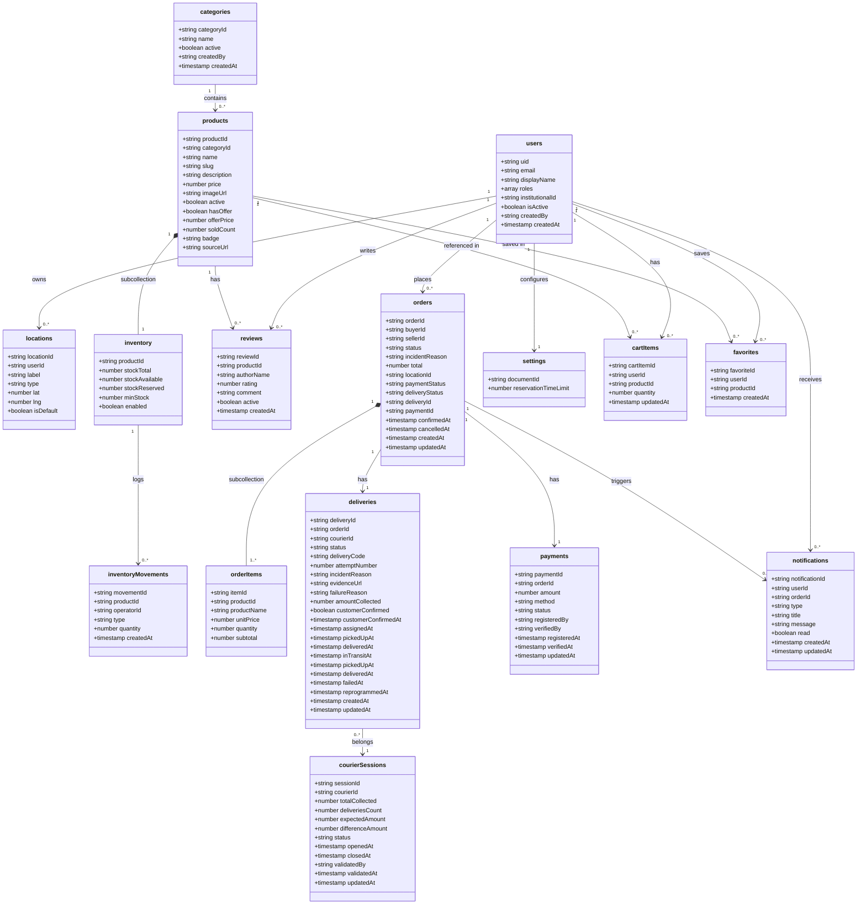

# Sansistore

Internal team docs and contribution workflow for the Sansistore project.

## Environments (Vercel)

| Branch       | Purpose                    | Deploy URL                         |
| ------------ | -------------------------- | ---------------------------------- |
| `main`       | Staging / QA (pre-release) | https://sansistore-test.vercel.app |
| `production` | Production (live)          | https://sansistore-umss.vercel.app |

## Requirements

- [Bun](https://bun.sh)
- Java 21 (for Firestore emulator)

## New dev quick start

```bash
bun install
bun dev
```

### Local emulators

Run Firestore and Auth emulators:

```bash
bun run emu
```

The frontend uses emulators when `PUBLIC_APP_ENV` is not `production` (Firestore: localhost:8080, Auth: localhost:9099).

### Seeding

Add test data to the local emulator:

```bash
bun run seed
```


If you need environment variables (Firebase, etc.), ask the team for the current `.env` values or check the Vercel project settings.

## Testing Environment

The repo contains the e2e testing suite powered by Playwright and Bun. To ensure consistent test results, you can run tests either directly on your machine or via Docker.

### Native Setup

Follow these steps to run tests directly on your OS.

**Prerequisites**

- Bun: [Installation Guide](https://bun.sh)
- Java 21: Required for the Firestore Emulator.
- Playwright Browsers: [Install the required binaries](https://playwright.dev/docs/browsers).

**Installation**

Install dependencies:

```bash
bun install
```

Install Playwright browsers and dependencies:

```bash
bunx playwright install --with-deps
```

**Running Tests**

- Run all tests: `bunx playwright test`
- Run a specific file: `bunx playwright test path/to/test.spec.ts`
- Run tests matching a name: `bunx playwright test -g "login"`
- View report: `bunx playwright show-report`

### Docker Usage

Use Docker to ensure a clean, isolated environment that matches CI.

**Basic Commands**

Run all tests:

```bash
docker compose up testing
```

Run specific tests:

```bash
docker compose run --rm testing bunx playwright test path/to/test.spec.ts
```

**Viewing Results**

Since the container shares volumes with your host, you can view the report generated inside Docker on your native machine:

```bash
bunx playwright show-report
```

## Data model

This is the base Firestore model. The database uses consistent English names for collections and fields.



## Branching and releases

Daily work:

1. Create a branch from `main` (`feature/*`, `fix/*`, `chore/*`).
2. Open a PR back into `main`.
3. Merge only when CI is green and the PR is approved.

End of sprint (release):

1. Open a pull request `main` → `production`.
2. Merge after QA sign-off.

Hotfixes:

1. Branch from `production` (`hotfix/*`).
2. PR into `production`.
3. Back-merge `production` → `main` (so QA stays in sync).

## Daily report

Use `@ScrumReports/` to log daily progress. Each team has a report file in `ScrumReports/` (e.g., `scrum_report_core_devs.md`).

```markdown
- **Yesterday:** <what you did> (include commit SHAs / PR/Issue # if relevant)
- **Today:** <what you will do>
- **Blockers:** <None | describe + what you need>
```

## Global rules

- Never force-push to `main` or `production`.
- Never push directly to `main` or `production`.
- Always start from an issue (User Story / Bug / Task).
- Use the PR template and keep descriptions clear.
- CI must pass before merging.

## Docs

Project documentation (start here): https://procesosagilesumss.github.io/sansistore/
