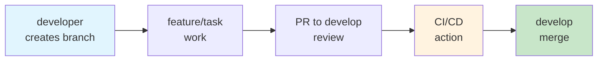
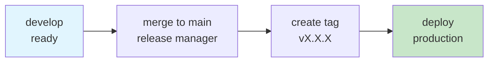
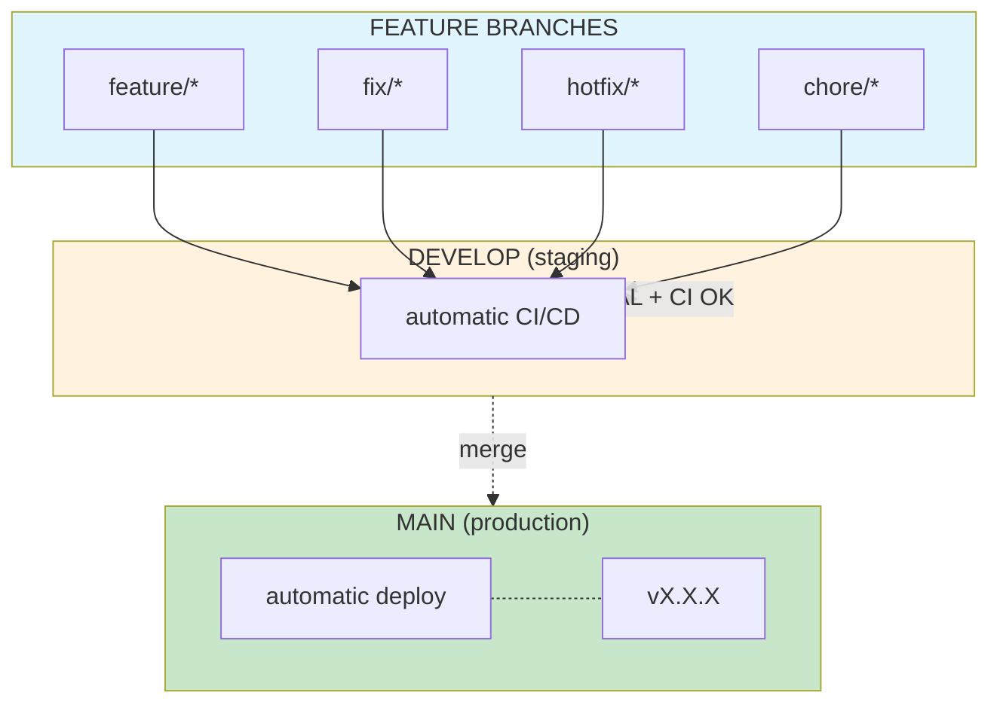

# Sansistore - CI/CD Workflow

## Docs

| Doc | Description |
|-----|-------------|
| [Architecture](docs/architecture.md) | Stack, folder structure and environments |
| [Branches](docs/branches.md) | Branch naming, prefixes and workflow |
| [Commits](docs/commits.md) | Format, types and examples |
| [CI/CD](docs/cicd.md) | Pipeline and deploy to production |
| [Pull Requests](docs/pull-requests.md) | Template, checklist and issue types |

---

## Daily flow



1. Create branch from `develop` → see [Branches](docs/branches.md)
2. Work and commit → see [Commits](docs/commits.md)
3. Open PR to `develop` and wait for approval + CI to pass → see [Pull Requests](docs/pull-requests.md)
4. Merge to `develop`

---

## Release flow



```bash
git checkout main && git merge develop && git push origin main
git tag -a v1.0.0 -m "Release v1.0.0"
git push origin v1.0.0
```

→ see [CI/CD](docs/cicd.md)

---

## General workflow



---

## Useful commands

| Command | Description |
|---------|-------------|
| `git checkout -b feature/your-task` | Create branch for task |
| `git checkout develop && git pull` | Update develop |
| `git push -u origin feature/your-task` | Push branch first time |
| `git push origin main` | Push to main (release only) |
| `git tag -a v1.0.0 -m "message"` | Create version tag |
| `git push origin v1.0.0` | Push tag to deploy |

---

## Frontend

**Stack:** Astro + React + Tailwind CSS + Firebase

```bash
bun install          # Install dependencies
bun dev              # Start dev server (localhost:4321)
bun build            # Production build
bun preview          # Preview build
bun astro check      # Typecheck
```

---

## Global rules

- **NEVER** `git push -f` to `develop` or `main`
- **NEVER** push directly to `main` or `develop`
- Always create an issue before starting work
- Always use PR template with clear description
- Wait for approval before merging
- CI must pass before merging
- Keep `develop` stable for the team
