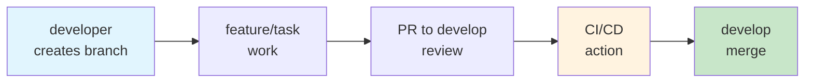
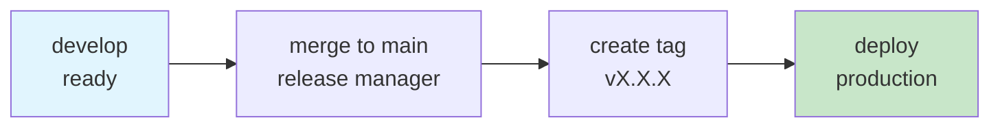
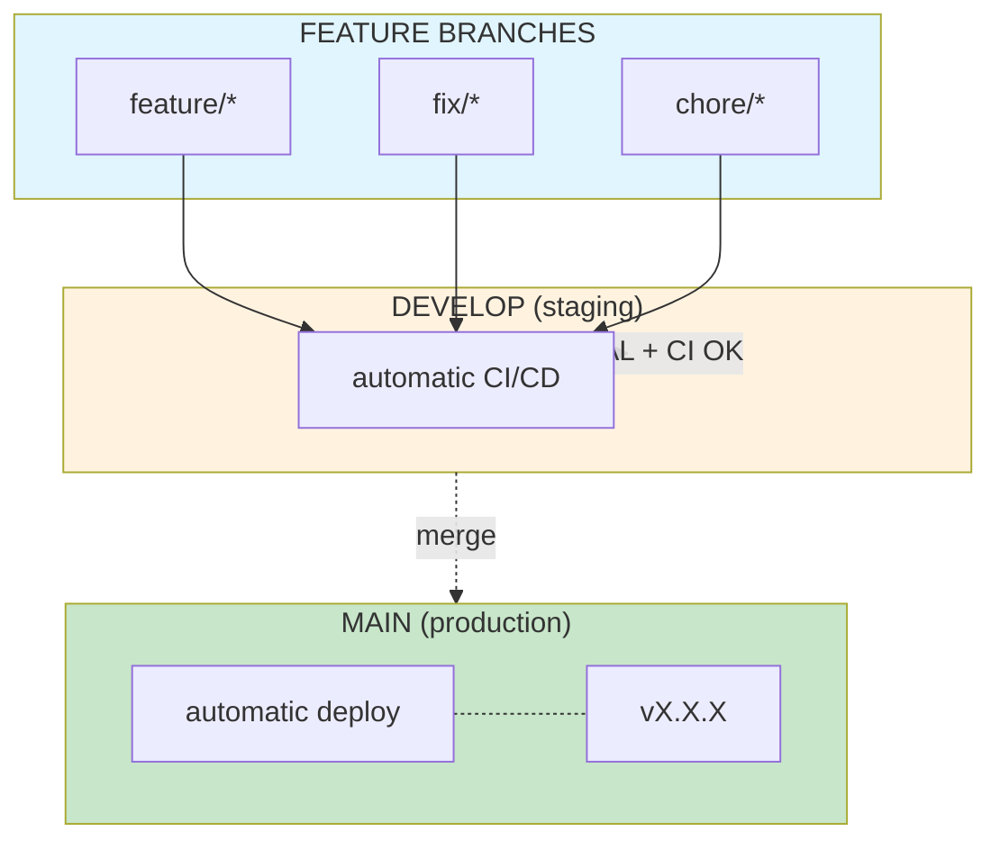

# Sansistore - CI/CD Workflow

## Workflow

### Global Rules
- **NEVER push directly to `main` or `develop`**
- All work requires Pull Request (PR)
- You need approval to merge

---

## Daily Development Flow



### Daily Steps

1. **Create your branch from develop**
   ```bash
   git checkout develop
   git pull origin develop
   git checkout -b feature/your-task
   ```

2. **Work on your task** and commit
   ```bash
   git add .
   git commit -m "feat: description of changes"
   ```

3. **Push your branch and create PR to develop**
   ```bash
   git push -u origin feature/your-task
   ```

4. **Wait for review** - Someone must approve your PR

5. **CI/CD runs automatically** on the PR

6. **Merge to develop** after approval + CI passing

---

## Release to Production Flow



### Release Steps

1. **Merge develop to main** (release manager only)
   ```bash
   git checkout main
   git merge develop
   git push origin main
   ```

2. **Create a version tag**
   ```bash
   git tag -a v1.0.0 -m "Release v1.0.0"
   git push origin v1.0.0
   ```

3. **GitHub Action detects the tag** and deploys to production

---

## General Workflow Diagram



---

## Issue Guidelines

Before creating a PR, create an issue first. Use the appropriate template:

| Issue Type | When to Use |
|------------|--------------|
| **User Story** | New feature from user perspective |
| **Bug Report** | Something not working |
| **Task** | Subtask or technical work |

Create issue: Go to Issues → New Issue → Select template

---

## Pull Request Template

When creating a PR, use the template (auto-filled):

```markdown
## Description
<!-- What does this PR do? Why is it needed? -->

## Type of Change
- [ ] New feature
- [ ] Bug fix
- [ ] Refactoring
- [ ] Documentation

## Related Issues
<!-- Closes #123 -->

## Checklist
- [ ] Code works as expected
- [ ] No new warnings or errors
- [ ] Self-reviewed
```

---

## Useful Commands

| Command | Description |
|---------|-------------|
| `git checkout -b feature/your-task` | Create branch for task |
| `git checkout develop && git pull` | Update develop |
| `git push -u origin feature/your-task` | Push branch first time |
| `git push origin main` | Push to main (release only) |
| `git tag -a v1.0.0 -m "message"` | Create version tag |
| `git push origin v1.0.0` | Push tag to deploy |

---

## Frontend Guide

Tech Stack: Astro + React + Tailwind CSS + Firebase

### Commands

```bash
bun install          # Install dependencies
bun dev              # Start dev server (localhost:4321)
bun build            # Production build
bun preview          # Preview build
bun astro check     # Typecheck
```

### Structure

```
src/
├── components/      # React/Astro components
├── layouts/         # Astro layouts
├── pages/           # Routes (file-based routing)
├── lib/             # Utilities, Firebase, etc.
└── styles/          # Global CSS
```

---

## Team Rules

1. **NEVER** do `git push -f` to develop or main
2. **NEVER** push directly to main or develop
3. Always create issues before starting work
4. Always use PR template with clear description
5. Wait for approval before merging
6. CI must pass before merging
7. Keep develop stable for others