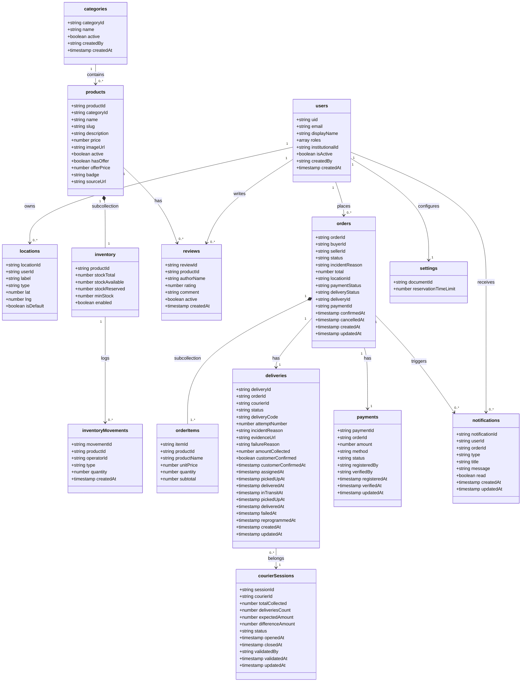

```mermaid
classDiagram
  class users {
    +string uid
    +string email
    +string displayName
    +array roles
    +string institutionalId
    +boolean isActive
    +string createdBy
    +timestamp createdAt
  }

  class locations {
    +string locationId
    +string userId
    +string label
    +string type
    +number lat
    +number lng
    +boolean isDefault
  }

  class categories {
    +string categoryId
    +string name
    +boolean active
    +string createdBy
    +timestamp createdAt
  }

  class products {
    +string productId
    +string categoryId
    +string name
    +string slug
    +string description
    +number price
    +string imageUrl
    +boolean active
    +boolean hasOffer
    +number offerPrice
    +string badge
    +string sourceUrl
  }

  class inventory {
    +string productId
    +number stockTotal
    +number stockAvailable
    +number stockReserved
    +number minStock
    +boolean enabled
  }

  class inventoryMovements {
    +string movementId
    +string productId
    +string operatorId
    +string type
    +number quantity
    +timestamp createdAt
  }

  class reviews {
    +string reviewId
    +string productId
    +string authorName
    +number rating
    +string comment
    +boolean active
    +timestamp createdAt
  }

  class orders {
    +string orderId
    +string buyerId
    +string sellerId
    +string status
    +string incidentReason
    +number total
    +string locationId
    +string paymentStatus
    +string deliveryStatus
    +string deliveryId
    +string paymentId
    +timestamp confirmedAt
    +timestamp cancelledAt
    +timestamp createdAt
    +timestamp updatedAt
  }

  class orderItems {
    +string itemId
    +string productId
    +string productName
    +number unitPrice
    +number quantity
    +number subtotal
  }

  class deliveries {
    +string deliveryId
    +string orderId
    +string courierId
    +string status
    +string deliveryCode
    +number attemptNumber
    +string incidentReason
    +string evidenceUrl
    +string failureReason
    +number amountCollected
    +boolean customerConfirmed
    +timestamp customerConfirmedAt
    +timestamp assignedAt
    +timestamp pickedUpAt
    +timestamp deliveredAt
    +timestamp inTransitAt
    +timestamp pickedUpAt
    +timestamp deliveredAt
    +timestamp failedAt
    +timestamp reprogrammedAt
    +timestamp createdAt
    +timestamp updatedAt
  }

  class payments {
    +string paymentId
    +string orderId
    +number amount
    +string method
    +string status
    +string registeredBy
    +string verifiedBy
    +timestamp registeredAt
    +timestamp verifiedAt
    +timestamp updatedAt
  }

  class courierSessions {
    +string sessionId
    +string courierId
    +number totalCollected
    +number deliveriesCount
    +number expectedAmount
    +number differenceAmount
    +string status
    +timestamp openedAt
    +timestamp closedAt
    +string validatedBy
    +timestamp validatedAt
    +timestamp updatedAt
  }

  class notifications {
    +string notificationId
    +string userId
    +string orderId
    +string type
    +string title
    +string message
    +boolean read
    +timestamp createdAt
    +timestamp updatedAt
  }

  class settings {
    +string documentId
    +number reservationTimeLimit
  }

  users "1" --> "0..*" locations : owns
  users "1" --> "0..*" orders : places
  users "1" --> "0..*" reviews : writes
  categories "1" --> "0..*" products : contains
  products "1" *-- "1" inventory : subcollection
  inventory "1" --> "0..*" inventoryMovements : logs
  products "1" --> "0..*" reviews : has
  orders "1" *-- "1..*" orderItems : subcollection
  orders "1" --> "1" deliveries : has
  orders "1" --> "1" payments : has
  deliveries "0..*" --> "1" courierSessions : belongs
  users "1" --> "1" settings : configures
  users "1" --> "0..*" notifications : receives
  orders "1" --> "0..*" notifications : triggers
```
